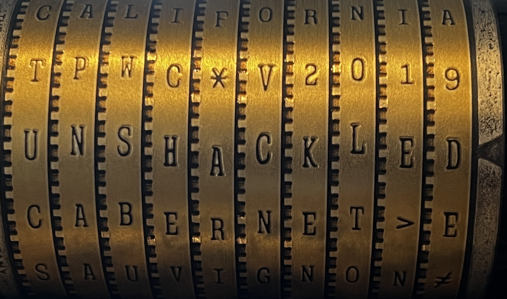

# KeyScanner
_BTC32 Private Key Experiments_

These Probably aren't the Droids You're Looking For.  Before you send me a missive calling this derivative or uncreative or ill-fated, remember: I advised you not to go any further and you did anyway..

--

Still here?  Alrighty then.   C'mon in and grab a seat and a cup of joe and embrace the madness with me.

Speaking of looking for things... I was thinking on the [BTC32 Puzzle](https://privatekeys.pw/faq#puzzle) about alternate searching algorithms, potential weaknesses in the RNG, alternative GPU solutions as alternatives to the scalar point multiplcation, ML solutions for discoverying patterns or anti-patterns that could lead to deterministic brute force exploits.



Motivation & considerations:

Myself, I have an unrecoverable wallet with a fraction of a btc from ~2012.  Laptop hard drive failure.  Attempted a clean-room-ish physical reconstruction of the drive but many sectors were corrupted in the failure.

POSIT:
Many of the abandoned wallets on the blockchain were based on Private Keys generated from very early openSSL (.98h) builds.

Theory:
Could there be exploits to recover my key based on BN_Rand_Range and contemporary platform limitations?  For instance, I know what version my btc client was running, what OS and hardware, I know a portion of the private key, the public key, the p2pkh address.  Coupled with known perfcounter value ranges, knowledge of when the key was created and the ability to mostly recreate that environment, could I set up a test scenaria to try to brute force my own missing private key?  (spoiler alert: no.)

Test:
I generated a billion keys using from-the-era hardware and OSs and did analysis looking for grouping anomalies in the set.   Even early openSSL         builds seem to have done a good job of stirring the pool between requests and using perfcounters to approximate random seeds and re-stirring parms.

CONCLUSION: I don't think there is anything here.  My BTC private key from that time is lost.  At least it wasn't life-changing money.

_Into the Looking Glass_

During the course of the above experiment, I did run into some interesting behaviors in the bn_rand_range when the range is a fraction of the order of G.  Call it a.. overwrap that seemed to defeat the distribution uniforminity, somewhat.  Researching this behavior, I ran into the BTC32 Puzzle Transactions.  
A set of deterministically generated private keys, funded with a fraction of BTC equal to the bitlength of the key.  The 64bit puzzle block was solved in September of 2022 after (3ish years) of significant effort in the community.  The 0 and 5 keys have exposed public keys, which open up Pollard Rho, Baby-Step/Giant-Step exploits but keys 64,66,67,68,69,71 and so fourth remain pure bruteforce metrics for algorithm testing.

The point of this project is to build out flexible test scenarios to poke at the BTC32 Puzzle problem.  Puzzle 64 was a key in the range of 8000000000000000:ffffffffffffffff.  18,438,744,073,709,551,615 keys are in the range. Assuming a single RTX 3090 could solve at 1.8 Billion Keys per second, it would take that card 118,561 days to traverse the keyspace.  Almost 325 years!  If you had 255 cards running with no hashrate loss and collaborative overlap, it would take 1.27 years.  You'd spend $275k in electricity for the chance to crack 0.64BTC in a ~year and it gets exponentially more difficult with each bit length in difficulty. Amazingly, BTC Puzzle 64 was solved this year!

Imagine the security implications if this wasn't the case, though.  I'm not just referring to btc, either.   ECC brute force shortcuts would have a tremendous impact on information security and you better believe this is an area of study for bad actors and white hats, alike.

..and.. that long winded intro is why I'm fascinated by this area of research:  The impact of emerging capabilities of GPUs, Machine Learning, Quantum Stepping algorithms and predictive modeling on communications security.

This was originally heavily based on experiments from [BitCrack](https://github.com/brichard19/BitCrack) by [brichard19](https://github.com/brichard19) and includes quality of life improvements contributed from [BitCrack2](https://github.com/secp8x32/BitCrack2) by [secpk8x32](https://github.com/secp8x32) 
and since incorporates the the epic foundational work of [VanitySearch] (https://github.com/JeanLucPons/VanitySearch) by [JeanLucPons] (https://github.com/JeanLucPons) and some really nice project reorganization and ideas from (now missing?) -> (https://github.com/phrutis/Rotor-Cuda.git)
Sorry, I'm sure I'm missing others who deserve a look and credit but the chain-of-fork / custody here is muddy because of folks changing their names and/or deleting their repos.

Anything clever here probably came from those folks, show them some love.  Anything hackneyed and BS probably came from me throwing things against the wall. This is CUDA only, sorry.  My boring real job keeps me pretty busy so multi-platform isn't in the cards for this hobby project atm.

This is highly experimental and fluid.

# Theory of Operation

I wanted something Random-based but targetable for this task.   Everytime someone asks for Random-based features, the feature forks I've found were half-measures or got backed out entirely b/c smart-people-concensus was "Random will never work at scale, so don't bother."

What I wanted out of this project was essentially a billion-spins-per-second private-key war dialer with semi-controllable RNG for distribution-bias experiments. 

I'm a jack-of-all-trades / master-of-none, so .. be patient with me. ¯\_(ツ)_/¯

# For Testing 38: 
```
keyscanner -g --gpui 0 --gpux 256,256 -m address --coin BTC -r 76 -o FOUNDTEST38.txt --range 2000000000:3fffffffff 1HBtApAFA9B2YZw3G2YKSMCtb3dVnjuNe2
```

Output:
```
  KeyScanner v2.01

  COMP MODE    : COMPRESSED
  COIN TYPE    : BITCOIN
  SEARCH MODE  : Single Address
  DEVICE       : GPU
  CPU THREAD   : 0
  GPU IDS      : 0
  GPU GRIDSIZE : 256x256
  BTC ADDRESS  : 1HBtApAFA9B2YZw3G2YKSMCtb3dVnjuNe2
  OUTPUT FILE  : FOUNDTEST38.txt

  Start Time   : Thu Dec 29 00:07:30 2022

  GPU          : GPU #0 NVIDIA GeForce RTX 3070 (46x128 cores) Grid(256x256)
  Base Key     : Randomly changes 65536 start Private keys every 76,000,000,000 on the counter
  Random : Min 38 (bit) 2000000000
  Random : Max 38 (bit) 3FFFFFFFFF

  [00:04:45] [R: 4] [312B3F8AB0] [F: 0] [GPU: 1.32 Gk/s] [T: 374,735,896,576]
  =================================================================================
  PubAddress: 1HBtApAFA9B2YZw3G2YKSMCtb3dVnjuNe2
  Priv (WIF): p2pkh:KwDiBf89QgGbjEhKnhXJuH7LrciVrZi3qYjgd9P3MahktLW5315v
  Priv (HEX): 22382FACD0
  PubK (HEX): 03C060E1E3771CBECCB38E119C2414702F3F5181A89652538851D2E3886BDD70C6
  =================================================================================

```

# For Testing 42: 
```
keyscanner -g --gpui 0 --gpux 256,256 -m address --coin BTC -r 1 -o FOUNDTEST42.txt --range 20000000000:3ffffffffff 1E32GPWgDyeyQac4aJxm9HVoLrrEYPnM4N
```
Output:
```
  KeyScanner v2.01

  COMP MODE    : COMPRESSED
  COIN TYPE    : BITCOIN
  SEARCH MODE  : Single Address
  DEVICE       : GPU
  CPU THREAD   : 0
  GPU IDS      : 0
  GPU GRIDSIZE : 256x256
  BTC ADDRESS  : 1E32GPWgDyeyQac4aJxm9HVoLrrEYPnM4N
  OUTPUT FILE  : FOUNDTEST42.txt

  Start Time   : Wed Dec 28 16:57:07 2022

  GPU          : GPU #0 NVIDIA GeForce RTX 3070 (46x128 cores) Grid(256x256)
  Base Key     : Randomly changes 65536 start Private keys every 1,000,000,000 on the counter
  ROTOR Random : Min 42 (bit) 20000000000
  ROTOR Random : Max 42 (bit) 3FFFFFFFFFF

  [01:11:51] [R: 2109] [3F109054000] [F: 0] [GPU: 575.19 Mk/s] [T: 2,481,283,137,536]
  =================================================================================
  PubAddress: 1E32GPWgDyeyQac4aJxm9HVoLrrEYPnM4N
  Priv (WIF): p2pkh:KwDiBf89QgGbjEhKnhXJuH7LrciVrZi3qYjgd9zzYEemjCVJ3vo9
  Priv (HEX): 2A221C58D8F
  PubK (HEX): 03EEC88385BE9DA803A0D6579798D977A5D0C7F80917DAB49CB73C9E3927142CB6
  =================================================================================
  [01:11:52] [R: 2109] [3FF7FD53162] [F: 1] [GPU: 560.07 Mk/s] [T: 2,482,222,661,632]
```

Note: The hash rate reported about was pretty low, that particular run used OpenSSL instead of the Thrust for RNG so the Key Generation wasn't performant. Keep in mind, lower R values will regenerate keys more frequently, which is at least partially CPU bound.   Higher R values lean more on the GPU.


Known Issues:

Really: single address and low-bit addresses is the only thing I've spent any time on to this point.  
(Comparing btcv1 contemporary OpenSSL vs Marsenne Twister vs Thrust)

Again, this is exploration and education for me. I'm not claiming any breakthroughs here! Just learnin' stuff.

There is code here for multi - address and xpoint (not my code, honestly)  based on an input file but I intend to refactor those eventually to something a little more user-friendly.   Also, I'm trying to understand how to implement alternate stepping sizes in a way that is similar to BitCrack's stride but doing so sort of violates the original auther's design, ultimately from VanitySearch, as far as I can tell.  I need some quiet time with JunLucPons' creation to understand it more thoroughly in order to do this in a way that doesn't break the implied matrix alignment.  It would really suck to solve 66 and have it return the wrong private key in output :)


## Tip Jar
- BTC: 31pjgrq8esTi9jKUL3S2Y4435MVABK4iHk
- ETH: 0x3cbe8027e756b9fe0cf18dcbbed9efb89b7ad9f0

## __Disclaimer__
THIS IS FOR EDUCATIONAL PURPOSES ONLY. USE IT AT YOUR OWN RISK. THE DEVELOPER WILL NOT BE RESPONSIBLE FOR ANY LOSS, DAMAGE OR CLAIM ARISING FROM USING THIS PROGRAM.
